# BTS Airline On-Time Performance — Microsoft Fabric Lakehouse

A medallion-architecture data engineering project in Microsoft Fabric, built over US Bureau of Transportation Statistics flight data.

**Scope:** January 2020 – June 2026 · 78 monthly files · **41.8 million flight records** · ~20 GB of source CSV

Demonstrates lakehouse architecture, PySpark transformation, incremental loading with watermark-driven `MERGE`, Data Factory orchestration, and a Direct Lake semantic model — with validation gates at every layer boundary.

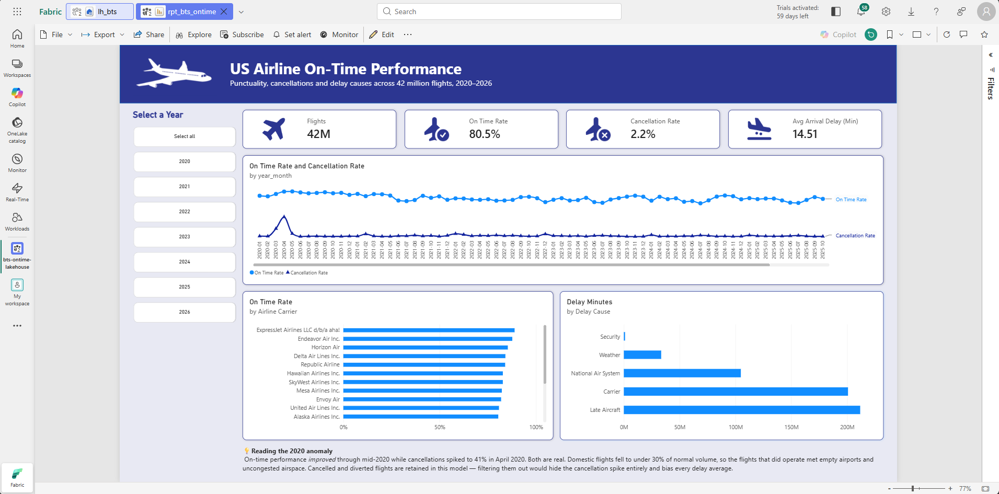

> **Note on reproducibility.** Fabric's Git integration syncs *item definitions*, not table contents. Cloning this repo gives you the notebooks, pipelines and semantic model, which will rebuild the model in any Fabric workspace, but the tables themselves live in OneLake. The screenshots in [`docs/`](docs/) are the evidence of the running system, captured while the trial capacity was live.

---

## Architecture

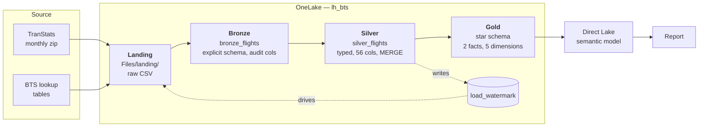

Layer separation is by table-name prefix within a single lakehouse. Three separate lakehouses would mean cross-lakehouse references in every notebook for no architectural gain at this scale.

### Orchestration

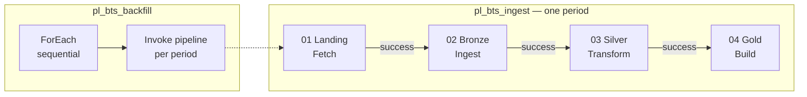

Activities are chained **on success**, not on completion. On-completion would let a failed landing step run bronze anyway, which is how partial data gets written and reported as a success.

All four activities share a Spark session tag so the pipeline runs as one Spark application rather than four — necessary on F4 capacity, and it removes three session startups from every run.

---

## The data

US DOT Bureau of Transportation Statistics — *Reporting Carrier On-Time Performance*, published monthly via [TranStats](https://transtats.bts.gov). One row per scheduled domestic flight leg: schedule, actual times, delay minutes attributed to five causes, cancellation and diversion flags.

**Why this dataset:**

- **Volume justifies the architecture.** ~600k flights per month, 41.8M rows over the full range.
- **Genuinely incremental.** BTS publishes monthly, so the pipeline processes real new periods rather than a simulated drip-feed.
- **The silver layer does real work.** Coded columns, `hhmm` integers without leading zeros, no arrival date, and nulls that mean different things in different columns.
- **The period covered contains a natural stress test.** Domestic flights fell from 648,229 in March 2020 to 180,617 in May — under 30% of normal volume, with a 41.5% cancellation rate in April.

Source archives are not committed to this repository.

---

## Pipeline

### Landing — `nb_01_landing_fetch`

Fabric notebooks have outbound internet access, so files are fetched **server-side** at datacentre bandwidth rather than uploaded. The notebook downloads a monthly zip to session-local `/tmp`, extracts the single CSV to `Files/landing/csv/`, and deletes the zip.

Zips are not retained in OneLake — Spark cannot read zip, so they would be storage for its own sake. Local archives are the provenance copy and were CRC-verified before ingestion (see [`scripts/Verify-BtsZips.ps1`](scripts/Verify-BtsZips.ps1)).

The same notebook refreshes the BTS carrier lookup tables. **TranStats obfuscates its query-string parameters**, so those URLs are captured constants rather than constructed — the documented-looking form returns the site homepage with a 200 status.

Two details worth noting: the source URL does *not* zero-pad the month, but landed filenames do, so they sort correctly. And an already-landed month returns `skipped`, making the notebook safe to re-run.

### Bronze — `nb_02_bronze_ingest`

Reads the CSV into Delta with an **explicit schema**, adds `_ingest_timestamp` and `_source_file`, and does nothing else. Source column names and shapes are preserved as the source contract.

**Why not infer the schema?** Inference reads the file twice and produces inconsistent types *between months* — a column that is entirely null in one month infers as `string` and as `int` in another, and the append then fails on a schema mismatch partway through a backfill. The schema is generated once from a reference month, hardened (all numeric measures forced to `double`), and **cached to `Files/landing/reference/bronze_schema.json`**. Later runs read a 20 KB file rather than making two passes over 260 MB of CSV.

**The phantom column.** BTS ends every row with a trailing comma, producing a 110th unnamed field. It is declared as `_phantom` and dropped by name. Reading with a 109-field schema also works, but Spark then flags every row as containing discarded data — a false "corrupted records" warning on 600k rows that trains you to ignore warnings. Declaring it is also faster: 13 seconds against 24.

**Idempotency** is by delete-then-append on `_source_file`. Bronze preserves the source shape and so has no reliable business key to merge on; the source file is the natural unit of reload, which is what that audit column is for.

### Silver — `nb_03_silver_transform`

Cleans, types, and merges one period. 109 source fields reduced to 56 using an explicit **keep-list rather than a drop-list**, so a new column in a future BTS vintage is ignored by default rather than flowing through uninvited. Names normalise to `snake_case` here, which also handles the casing variance between download vintages.

Bronze preserves the source contract — 111 columns, BTS PascalCase, `hhmm` integers untouched:

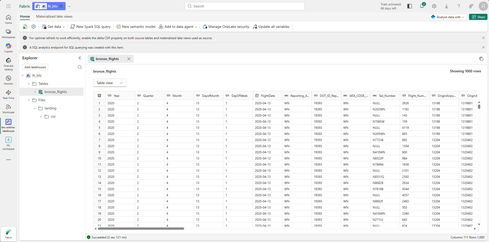

Silver is the same data, typed and named for the model:

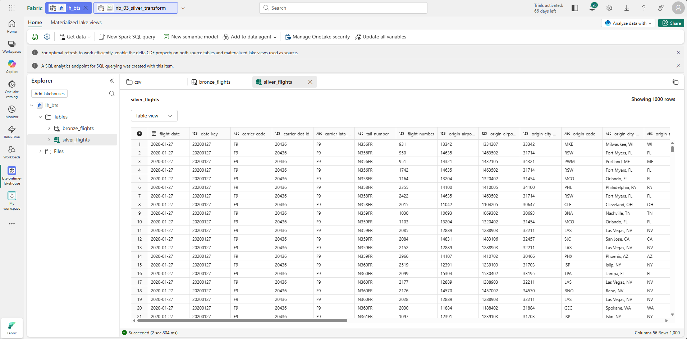

#### Timestamp derivation

The substance of this layer, and the fiddliest transform in the project.

**Departure side** is built from `FlightDate` plus the `hhmm` integer, split arithmetically (`hours = t // 100`, `minutes = t % 100`) so the missing leading zero needs no string handling. `2400` means midnight **on the following day** — normalising it to `0000` without advancing the date silently moves the flight 24 hours earlier.

**Arrival side** takes the *date* from arithmetic and the *clock* from BTS.

The obvious approach — add elapsed minutes to the departure timestamp — was tested and produced a **48% mismatch** against the reported `ArrTime`. Every mismatch was a whole number of hours and tracked direction of travel:

| Route | Derived | Reported | Difference |
|---|---|---|---|
| MKE → RSW | 09:18 | 10:18 | +1 (Central → Eastern) |
| MCO → LAS | 16:22 | 13:22 | −3 (Eastern → Pacific) |
| LAS → PHX | 20:25 | 21:25 | +1 (Pacific → Mountain) |

`ActualElapsedTime` is gate-to-gate in *local clock time at each end*, so pure arithmetic yields origin-local time while BTS reports destination-local. The hybrid — arithmetic establishes which day the flight landed on, `ArrTime` supplies the destination-local clock — resolves this without requiring an airport-to-timezone reference dataset.

Note the `2400` rule **differs between the two functions**, deliberately: on the departure side the base date has not moved, so a day is added; on the arrival side the arithmetic has already crossed midnight, so it is not. Applying the departure rule to arrivals put 532 rows two days out.

#### Validation gates

`validate_timestamps()` runs two **independent** checks and raises on failure:

1. Derived clock matches the BTS reported time of day.
2. Arrival date is the flight date or the day after — never earlier, never two days later.

The `2400` bug passed check 1 at 100% and was caught only by check 2. One passing check is not validation.

The `raise` matters: when the pipeline runs unattended, a bad month must fail the run rather than quietly write wrong data.

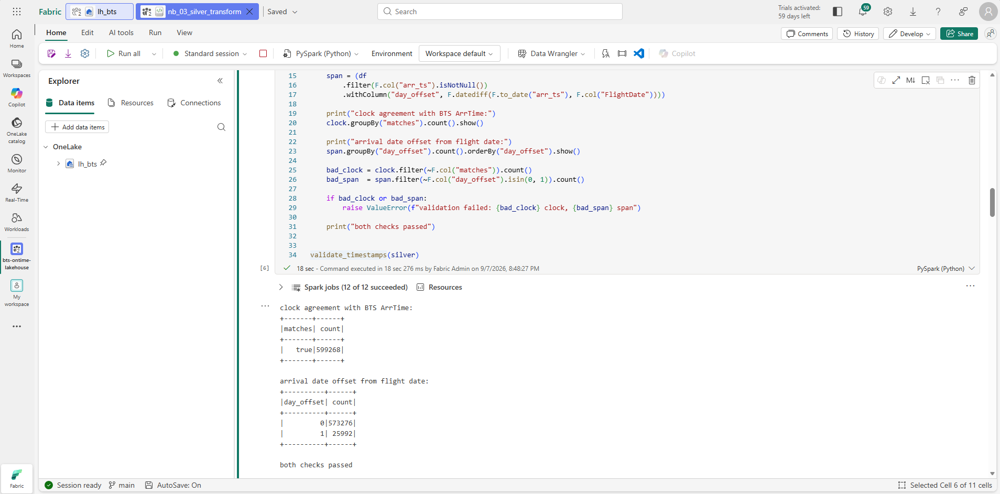

#### Incremental load

Business key: `flight_date` + `carrier_code` + `flight_number` + `origin_airport_id` + `dest_airport_id` + `crs_dep_time_hhmm`.

`crs_dep_time_hhmm` is necessary — without it the key breaks on the rare case of the same flight number operating the same route twice in one day. The uniqueness check stays in the load path as a permanent gate, and has passed on every period.

The merge condition uses `<=>`, not `=`. Null-safe equality: standard `=` returns null when either side is null, so a row with a null key column would never match itself and would insert a duplicate on *every* run.

`load_watermark` records `(year, month, source_file, row_count, status, loaded_at)`, itself upserted on `(year, month)` so re-running a period updates its record rather than adding a second one.

### Gold — `nb_04_gold_build`

Star schema. Dimensions rebuild in full every run; facts merge incrementally by period.

**Natural keys throughout** — `airport_id` (DOT numeric), `carrier_code`, and an integer `date_key` of `yyyymmdd`. Generated surrogates are fragile in a lakehouse: `monotonically_increasing_id()` is not stable across reruns, and a proper key-assignment step adds pipeline machinery this project does not need.

Airports are keyed on `airport_id`, **not** the three-letter IATA code — BTS reuses IATA codes across different airports over time. A check counts distinct IDs against distinct codes on every run.

`dim_carrier` joins to the BTS `L_AIRLINE_ID` lookup on **DOT ID, not carrier code**, because BTS defines a unique airline by its DOT certificate regardless of code, name, or holding company, and reuses codes across carriers over time (their own example: `PA`, `PA(1)`, `PA(2)`). The join is a `left` join so a carrier missing from the lookup survives with a null name rather than vanishing and orphaning facts.

Rebuilding dimensions in full rather than incrementally is what handled late-arriving members without special casing: `dim_airport` grew from 367 to 387 and `dim_carrier` from 17 to 18 as periods outside the development slice introduced airports and carriers that had not appeared before — including one airport that arrived with June 2026, after the backfill had finished.

#### Grain

**One row per scheduled flight leg as reported, including cancelled and diverted flights.**

Filtering cancellations out is the common mistake with this dataset. It destroys cancellation-rate analysis and biases every delay average, because the worst operational days are the ones with the most cancellations. April 2020 would lose two fifths of its rows.

#### `fact_delay_attribution`

BTS reports delay causes as five parallel columns. These are unpivoted with Spark's `stack()` so the grain becomes flight-plus-cause, turning five near-duplicate measures into one. Nulls are **not** coalesced to zero — that would fabricate on-time flights with zero-minute delays.

Across the full range:

| Cause | Rows | Avg minutes | Total minutes |
|---|---|---|---|
| Late aircraft | 3,903,079 | 54.2 | 211.7M |
| Carrier | 4,448,866 | 45.1 | 200.8M |
| National Air System | 3,825,488 | 27.4 | 104.8M |
| Weather | 475,464 | 70.4 | 33.5M |
| Security | 40,481 | 27.4 | 1.1M |

Late aircraft leads on total minutes despite fewer occurrences than carrier delay — the cascade effect, where one delayed aircraft makes its subsequent flights late. Weather is the rarest cause and by far the most severe per occurrence.

**Attribution covers 91.3% of arrival delay minutes** (measured on January 2020: 5,283,250 of 5,785,006). The gap is flights delayed 1–14 minutes, for which BTS reports no cause. The unattributed share moves with severity: 11.7% in April 2020 when delays were mild, 5.2% in June 2023 when they were long. This is correct behaviour, not a data quality issue.

---

## Semantic model — `sm_bts_ontime`

Direct Lake over the seven gold tables only. Bronze, silver and `load_watermark` are deliberately excluded — a semantic model is the presentation layer, and staging tables in it are working notes shipped to the customer.

Eleven measures live on a dedicated `_measures` table with its single dummy column hidden, so they sort to the top of the field list rather than hiding inside a fact table.

**`dim_airport` role-plays.** Two relationships to `fact_flight`: active on `origin_airport_id`, inactive on `dest_airport_id`. `Arriving Flights` exposes the destination side via `USERELATIONSHIP`, so one dimension answers both "flights from LAX" and "flights to LAX".

**All relationships use Assume referential integrity**, which generates INNER rather than OUTER joins on a 41M-row fact. That is a promise, not a check — it is only safe because `nb_04` verifies exactly these five relationships with `left_anti` joins on every load and raises on failure.

**`Completed Flights` is the measure that matters.** It excludes cancelled and diverted flights and is the correct denominator for punctuality, because a cancelled flight has no arrival time and must not dilute a delay average. `Flights` is the denominator for reliability. Conflating the two is the subtle version of the grain mistake above.

Delay averages use the `_minutes` variants, which floor at zero. Using `arr_delay` would let early arrivals offset late ones and produce a much lower, misleading figure.

### Report

One page: KPI cards, on-time and cancellation rate by month across the full range, carrier comparison, and delay minutes by cause.

The page carries a note explaining that on-time performance *improved* through mid-2020 while cancellations spiked to 41.5%. Both are real — domestic volume fell below 30% of normal, so the flights that did operate met empty airports and uncongested airspace. April 2020 records **95.1% on-time and 41.5% cancelled in the same month**: the best punctuality and the worst reliability in the dataset. Retaining cancelled flights is what makes that visible.

---

## Validation and results

Every layer boundary has a check that fails the run rather than warning.

| Check | Where | Result |
|---|---|---|
| Source archives CRC-verified before ingestion | `scripts/Verify-BtsZips.ps1` | 77/77 valid, 1.92 GB |
| Explicit schema holds across vintages | `nb_02` | Held across all 78 periods, 2020–2026 |
| Derived clock matches BTS reported time | `nb_03` | 100%, every period |
| Arrival date within 0–1 days of flight date | `nb_03` | 100%, zero outside range |
| Business key unique | `nb_03` | 0 duplicates, every period |
| Silver merge idempotent | `nb_03` | Row count unchanged on full re-run at 41.2M rows |
| Every `arr_del15` flight appears in attribution | `nb_04` | 82,285 = 82,285 (January 2020) |
| Referential integrity, five relationships | `nb_04` | 0 orphans across 41.2M rows |

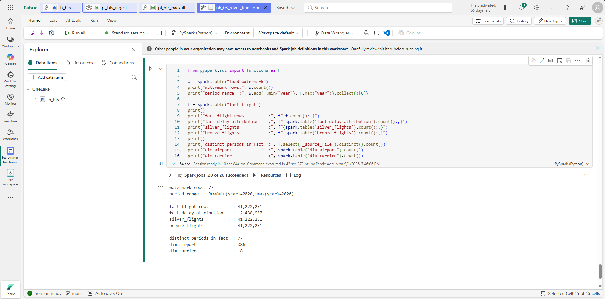

### Final row counts

| Table | Rows |
|---|---|
| `bronze_flights` | 41,829,828 |
| `silver_flights` | 41,829,828 |
| `fact_flight` | 41,829,828 |
| `fact_delay_attribution` | 12,693,378 |
| `dim_airport` | 387 |
| `dim_carrier` | 18 |
| `dim_date` | 2,953 |
| `load_watermark` | 78 |

Identical counts across bronze, silver and fact — no drift through the chain.

At completion of the 77-period backfill these stood at 41,222,251 rows and 386 airports; the figures above include the subsequent incremental load of June 2026.

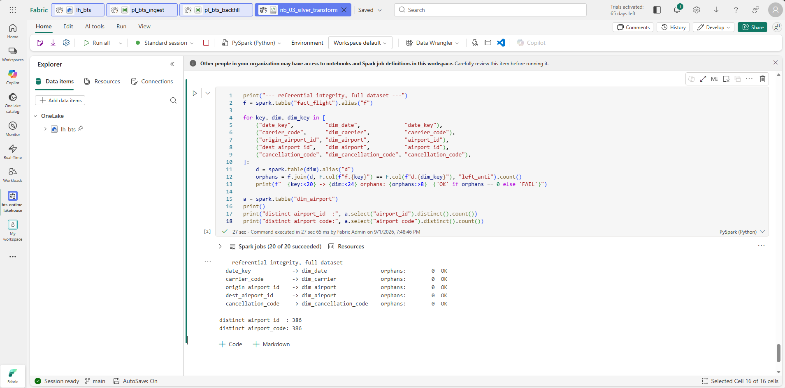

### Measured performance

Fabric trial capacity, **F4 (4 CU)**, East Asia.

| Operation | Duration |
|---|---|
| Fetch + extract one month (~250 MB CSV) | ~53 s |
| Bronze ingest, 607k rows | ~13 s |
| Silver transform + merge, 577k rows | ~1 m 22 s |
| Gold rebuild + fact merge | ~2 m 25 s |
| **Full pipeline, one period** | **~6.5 min** |
| **Full backfill, 71 periods** | **7 h 6 min** |

The backfill ran unattended with **zero failures**. Retries were configured on each activity (two attempts, 120-second interval) but never fired.

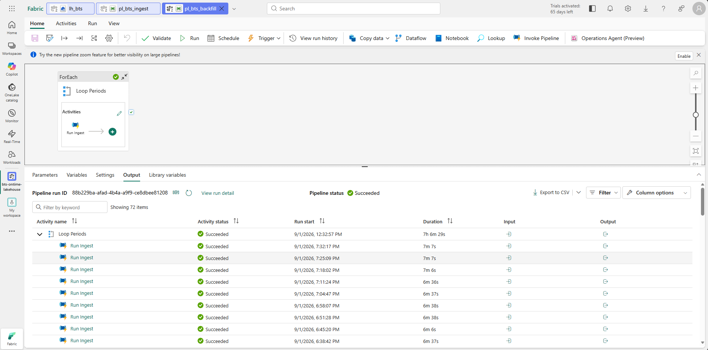

### Incremental load, demonstrated

June 2026 was deliberately held back from the backfill and loaded afterwards through the same single-period pipeline, unchanged:

| | Before | After |
|---|---|---|
| Periods in `load_watermark` | 77 | 78 |
| `fact_flight` rows | 41,222,251 | 41,829,828 |

The delta is exactly 607,577 — June's row count as recorded in the watermark. No double-counting, no manual intervention.

<table>
<tr>
<td width="50%">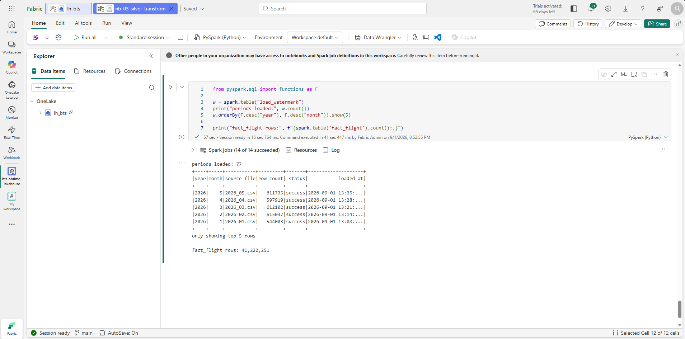</td>
<td width="50%">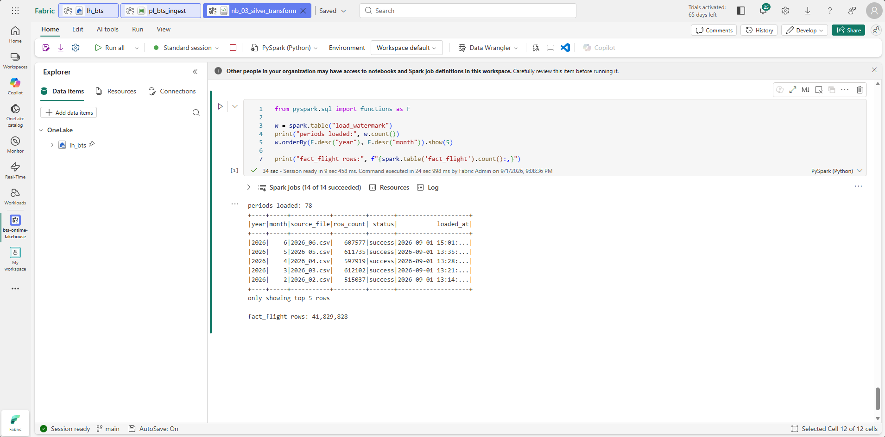</td>
</tr>
<tr>
<td align="center"><em>Before — 77 periods, 41,222,251 rows</em></td>
<td align="center"><em>After — 78 periods, 41,829,828 rows</em></td>
</tr>
</table>

### Failure path

A subsequent attempt at July 2026 returned HTTP 404: BTS had not yet published it. `raise_for_status()` caught it, landing failed, and on-success chaining meant bronze, silver and gold never ran — they show as unstarted rather than skipped or failed. No partial data, no false success.

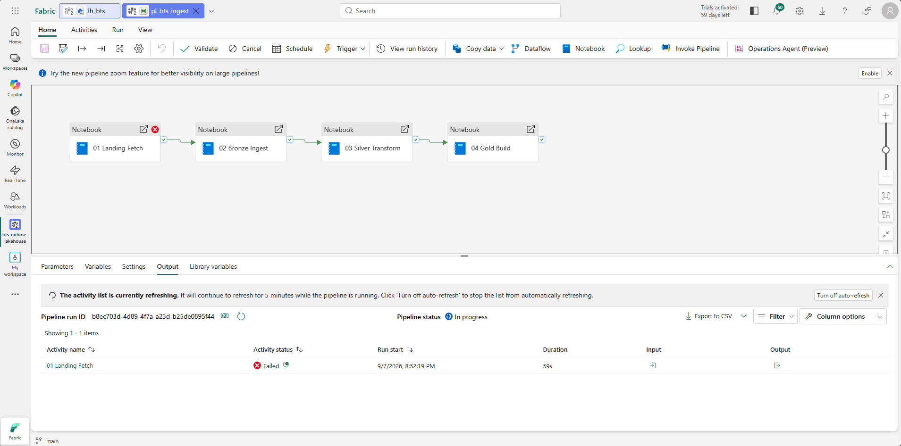

---

## Known limitations

**Arrival timestamps are destination-local wall clock with a date derived from origin-local arithmetic.** A small residual exists where the arithmetic date lands on the other side of midnight from the destination-local date. Timezone-correct conversion would require a third data source keyed on IATA codes — exactly the unstable join this model avoids elsewhere — plus DST-aware conversion, for accuracy no measure in the model consumes. Every metric here is a duration or a delay, both differences within the same frame.

**IATA code reuse is defended against but not observed in this range.** Across all 78 periods the check reports 387 distinct `airport_id` and 387 distinct `airport_code` — no collisions. BTS reuses codes across decades, so six and a half years is not long enough to exercise it. The check stays as a gate; keying on `airport_id` is defensive against documented source behaviour rather than a response to observed breakage.

**Delay-cause totals do not reconcile to all delay minutes**, by design. See above.

**Both `dep_delay` and `dep_delay_minutes` are retained.** The first goes negative for early departures; the second floors at zero. Averaging the wrong one gives a different answer.

**The pipeline takes an explicit period rather than deriving it.** A Lookup activity against `load_watermark` returning the next unprocessed period would make a schedule self-driving. The watermark table already supports this; the activity was not needed for the backfill.

### Deferred

- Timezone-correct arrival timestamps
- Type 2 SCD on `AirportSeqID` (already retained in silver)
- `DimTimeBlock` from the retained time-block columns
- Watermark-driven period selection and a monthly schedule

---

## Repository layout

```
├── fabric/                       Fabric items, synced via Git integration
│   ├── lh_bts.Lakehouse/
│   ├── nb_00_connectivity_test.Notebook/
│   ├── nb_01_landing_fetch.Notebook/
│   ├── nb_02_bronze_ingest.Notebook/
│   ├── nb_03_silver_transform.Notebook/
│   ├── nb_04_gold_build.Notebook/
│   ├── pl_bts_ingest.DataPipeline/
│   ├── pl_bts_backfill.DataPipeline/
│   ├── sm_bts_ontime.SemanticModel/
│   └── rpt_bts_ontime.Report/
├── docs/                         Build evidence and decisions record
└── scripts/
    └── Verify-BtsZips.ps1        Source archive validation
```

Notebooks sync as readable `.py` files and the semantic model as TMDL — the transformation logic, relationships and DAX can be read directly on GitHub without a Fabric workspace.

Git integration was connected to an empty workspace **before any items were created**, so the commit history tracks the build rather than arriving as one bulk import:

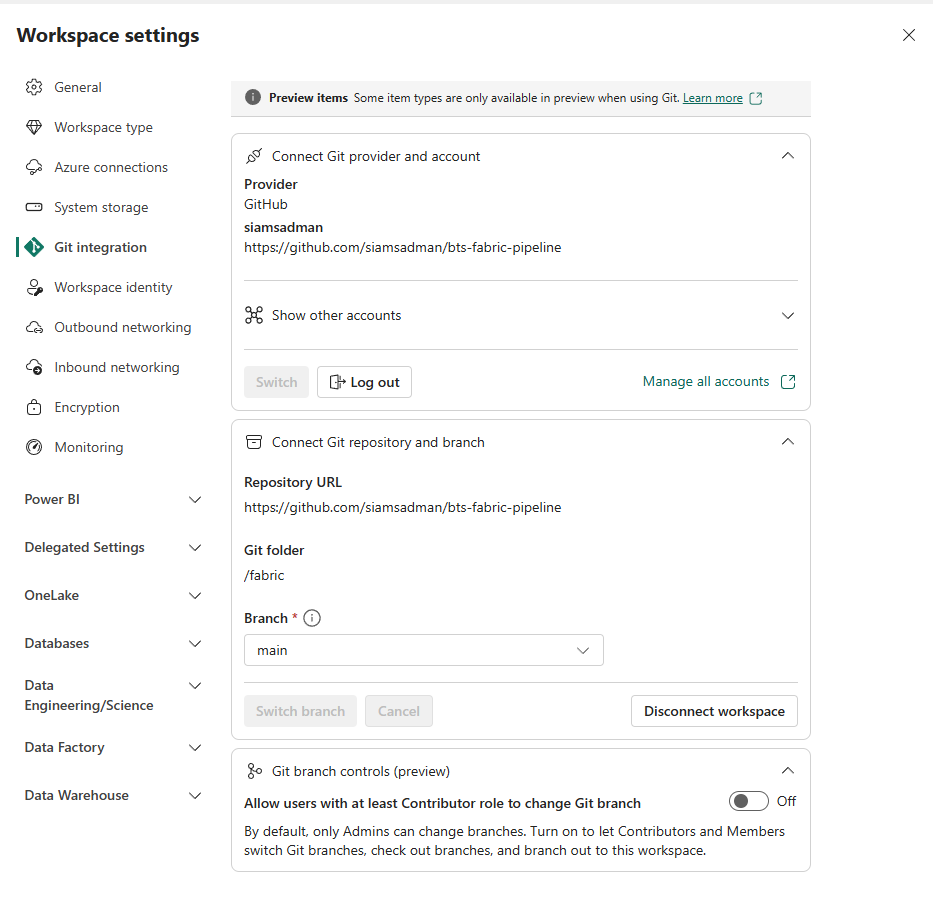

---

## Notes on the Fabric platform

Three defaults that cost time and are not obvious from the error messages:

**GitHub sync is disabled tenant-wide by default.** *Users can sync workspace items with GitHub repositories* lives in the Admin portal, not workspace settings. With it off, GitHub simply does not appear in the workspace Git provider list — it looks like a missing feature rather than a permission.

**High concurrency for pipelines is off by default.** Four notebook activities in sequence each request their own Spark session, and on F4 the second fails with `TooManyRequestsForCapacity` (HTTP 430). Session tags are the mechanism, but they are ignored for pipelines unless *Spark settings → High concurrency → For pipeline running multiple notebooks* is enabled. The equivalent toggle for interactive notebooks is on by default, which makes the asymmetry easy to miss.

**A notebook parameter cell must be toggled, not merely present.** A cell containing `process_year = 2020` does nothing unless toggled via the cell menu. Untoggled, pipeline values are silently ignored and the notebook runs its defaults — and the failure surfaces two activities downstream, where silver's zero-row guard raises `no bronze rows for 2020_02.csv`. The guard converted a silent misconfiguration into a named, actionable error.

One more worth knowing: **HTTP 200 does not mean success.** TranStats returns a 200 with an HTML body for URLs it does not recognise, which produced two separate false positives during the build. Both fetch paths assert on content — the zip download checks magic bytes, the lookup checks the CSV header — rather than trusting the status code.
